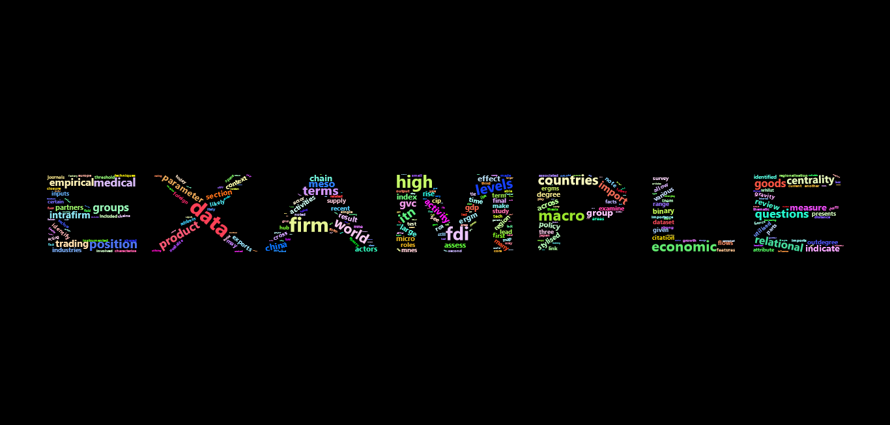

Wordcloud-Script
================

R script to create wordcloud from text document, using the `wordcloud2` package.

Example
-------

Here is an example of how to create a wordcloud. I use my PhD thesis as the example text. My PhD thesis can be found at: <https://www.researchgate.net/publication/319876899_Corporate_networks_of_international_investment_and_trade>

First, load the relevant libraries:

``` r
library(tm)
library(magrittr)
#library(devtools)
#devtools::install_github("lchiffon/wordcloud2")
library(wordcloud2)
```

Then I save the document as a .txt file and then read into R:

``` r
text1<-"C:\\Users\\example.txt"
text2 <-readLines(text1)
DOCtxt<-Corpus(VectorSource(text2))
```

I then clean the document, removing whitespace, common words and numbers. I convert all words to lowercase. And finally, I remove a list of words - these are common words for this particular document:

``` r
DOCtxt_data<-tm_map(DOCtxt,stripWhitespace)%>%tm_map(.,tolower)%>%
  tm_map(.,removeNumbers)%>%tm_map(.,removePunctuation)%>%
  tm_map(.,removeWords,stopwords("english"))%>%
  tm_map(.,removeWords,"course")
  tm_map(.,removeWords,c("and","the","our","that","table","figure",
                         "for","are","also","more","has",
                         "must","have","should","this",
                         "with","furthermore","PhD",
                         "additionally","in","number",
                         "which","patterns","use","one",
                         "approach","whether","capture",
                         "effects","specifically",
                         "instance","yet","two",
                         "rather","approaches","along",
                         "however","extent","provides",
                         "applied","characterised",
                         "amongst","need","often","order",
                         "table","based","key","examining",
                         "captures","important","positive","using",
                         "negative","better","perspective","journal",
                         "case","therefore","can","work","et","al",
                         "used","role","set","studies","measures",
                         "paper","provide","figures","tables"))
```

From this - we create an object providing words and frequency:

``` r
dtm<- TermDocumentMatrix(DOCtxt_data)%>%as.matrix()
v <- sort(rowSums(dtm),decreasing=TRUE)
d <- data.frame(word = names(v),freq=v)
```

Wordcloud Plot
--------------

Now I have the clean object, I can create the plots.

### Wordcloud plot:

``` r
wordcloud2(d)
```

    ## Warning: package 'htmlwidgets' was built under R version 3.4.4

    ## Warning: package 'webshot' was built under R version 3.4.4


### Letterplot:

``` r
letterCloud(d, word = "EXAMPLE", color='random-light' , backgroundColor="black")
```



Writing Plots to files
----------------------

These plots output to html, where you can then save as an image in your web browser. Otherwise, you can save these as images directly in R, using `htmlwidget` and `webshot` packages.

``` r
#install webshot
library(webshot)
webshot::install_phantomjs()

## Make the wordcloud
CLOUD<-wordcloud2(d)

## save it in html
library("htmlwidgets")
saveWidget(CLOUD,"CLOUD.html",selfcontained = F)

## Save as image (png, jpeg or pdf)
###It is important to specify a delay - as this gives time for the wordcloud to load fully in html

webshot("CLOUD.html","CLOUD_1.png", delay =15)

webshot("CLOUD.html","CLOUD_1.pdf", delay =15)
```
